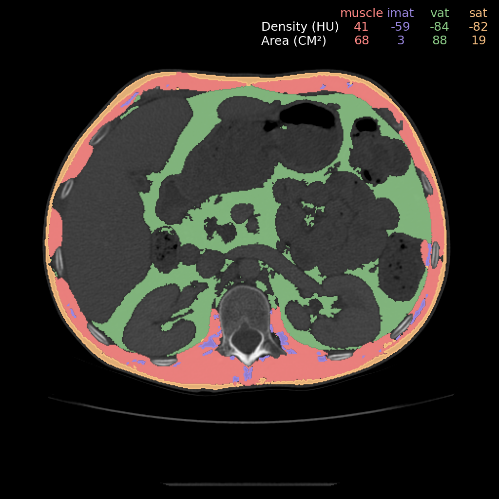

#  Comp2Comp 
[](https://www.gnu.org/licenses/gpl-3.0)

[](https://comp2comp.readthedocs.io/en/latest/?badge=latest)

[**Paper**](https://arxiv.org/abs/2302.06568)
| [**Installation**](#installation)
| [**Basic Usage**](#basic_usage)
| [**Inference Pipelines**](#basic_usage)
| [**Contribute**](#contribute)
| [**Citation**](#citation)

Comp2Comp is a library for extracting clinical insights from computed tomography scans. 

## Installation
<a name="installation"></a>
```bash
# Install from local clone:
git clone https://github.com/StanfordMIMI/Comp2Comp/

# Install script requires Anaconda/Miniconda.
cd Comp2Comp && bin/install.sh
```
For installing on the Apple M1 chip, see [these instructions](https://github.com/StanfordMIMI/Comp2Comp/blob/docs/docs/Local%20Implementation%20%40%20M1%20arm64%20Silicon.md).

## Basic Usage
<a name="basic_usage"></a>
```bash
bin/C2C <pipeline_name> --input_path <path/to/input/folder>
```

For running on slurm, modify the above commands as follow:
```bash
bin/C2C-slurm <pipeline_name> --input_path <path/to/input/folder>
```

## Inference Pipelines
<a name="inference_pipeline"></a>
We have designed Comp2Comp to be highly extensible and to enable the development of complex clinically-relevant applications. We observed that many clinical applications require chaining several machine learning or other computational modules together to generate complex insights. The inference pipeline system is designed to make this easy. Furthermore, we seek to make the code readable and modular, so that the community can easily contribute to the project. 

The [`InferencePipeline` class](comp2comp/inference_pipeline.py) is used to create inference pipelines, which are made up of a sequence of [`InferenceClass` objects](comp2comp/inference_class_base.py). When the `InferencePipeline` object is called, it sequentially calls the `InferenceClasses` that were provided to the constructor. 

The first argument of the `__call__` function of `InferenceClass` must be the `InferencePipeline` object. This allows each `InferenceClass` object to access or set attributes of the `InferencePipeline` object that can be accessed by the subsequent `InferenceClass` objects in the pipeline. Each `InferenceClass` object should return a dictionary where the keys of the dictionary should match the keyword arguments of the subsequent `InferenceClass's` `__call__` function. If an `InferenceClass` object only sets attributes of the `InferencePipeline` object but does not return any value, an empty dictionary can be returned. 

Below are the inference pipelines currently supported by Comp2Comp.

## Spine Bone Mineral Density from 3D Trabecular Bone Regions at T12-L5

### Usage
```bash
bin/C2C spine --input_path <path/to/input/folder>
```
- input_path should contain a DICOM series or subfolders that contain DICOM series.

### Example Output Image
<p align="center">
  
</p>

## Slice-by-Slice 2D Analysis of Muscle and Adipose Tissue

### Usage
```bash
bin/C2C muscle_adipose_tissue --input_path <path/to/input/folder>
```
- DICOM files within the input_path folder and subfolders of input_path will be processed.

### Example Output Image
<p align="center">
  
</p>

## End-to-End Spine, Muscle, and Adipose Tissue Analysis at T12-L5

### Usage
```bash
bin/C2C spine_muscle_adipose_tissue --input_path <path/to/input/folder>
```
- input_path should contain a DICOM series or subfolders that contain DICOM series.

### Example Output Image
<p align="center">
  
</p>

## Contrast Phase Detection

### Usage
```bash
bin/C2C contrast_phase --input_path <path/to/input/folder>
```
- input_path should contain a DICOM series or subfolders that contain DICOM series.
- This package has extra dependencies. To install those, run:
```bash
cd Comp2Comp
pip install -e '.[contrast_phase]'
```

## 3D Analysis of Liver, Spleen, and Pancreas

### Usage
```bash
bin/C2C liver_spleen_pancreas --input_path <path/to/input/folder>
```
- input_path should contain a DICOM series or subfolders that contain DICOM series.

### Example Output Image
<p align="center">
  
</p>


## In Progess
- Abdominal Aortic Aneurysm Detection
- Hip Analysis

## Contribute
<a name="contribute"></a>
If you would like to contribute to Comp2Comp, we recommend you clone the repository and install Comp2Comp with `pip` in editable mode.

```bash
git clone https://github.com/StanfordMIMI/Comp2Comp
cd Comp2Comp
pip install -e '.[dev]'
make dev
```

To run tests, build documentation and contribute, run
```bash
make autoformat
```

## Citation
<a name="citation"></a>
``` 
@article{blankemeier2023comp2comp,
  title={Comp2Comp: Open-Source Body Composition Assessment on Computed Tomography},
  author={Blankemeier, Louis and Desai, Arjun and Chaves, Juan Manuel Zambrano and Wentland, Andrew and Yao, Sally and Reis, Eduardo and Jensen, Malte and Bahl, Bhanushree and Arora, Khushboo and Patel, Bhavik N and others},
  journal={arXiv preprint arXiv:2302.06568},
  year={2023}
}
```

In addition to Comp2Comp, please consider citing TotalSegmentator:
```
@article{wasserthal2022totalsegmentator,
  title={TotalSegmentator: robust segmentation of 104 anatomical structures in CT images},
  author={Wasserthal, Jakob and Meyer, Manfred and Breit, Hanns-Christian and Cyriac, Joshy and Yang, Shan and Segeroth, Martin},
  journal={arXiv preprint arXiv:2208.05868},
  year={2022}
}
```


