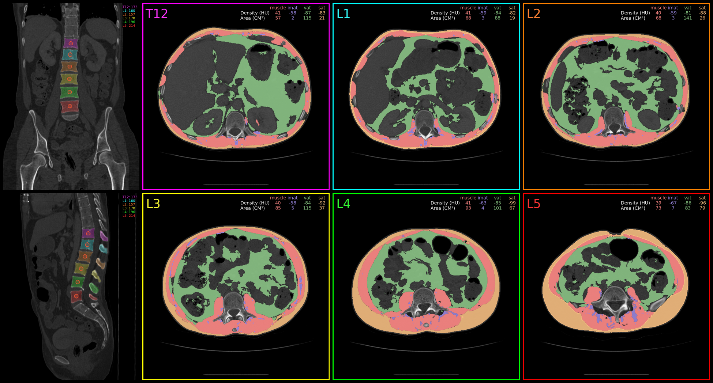
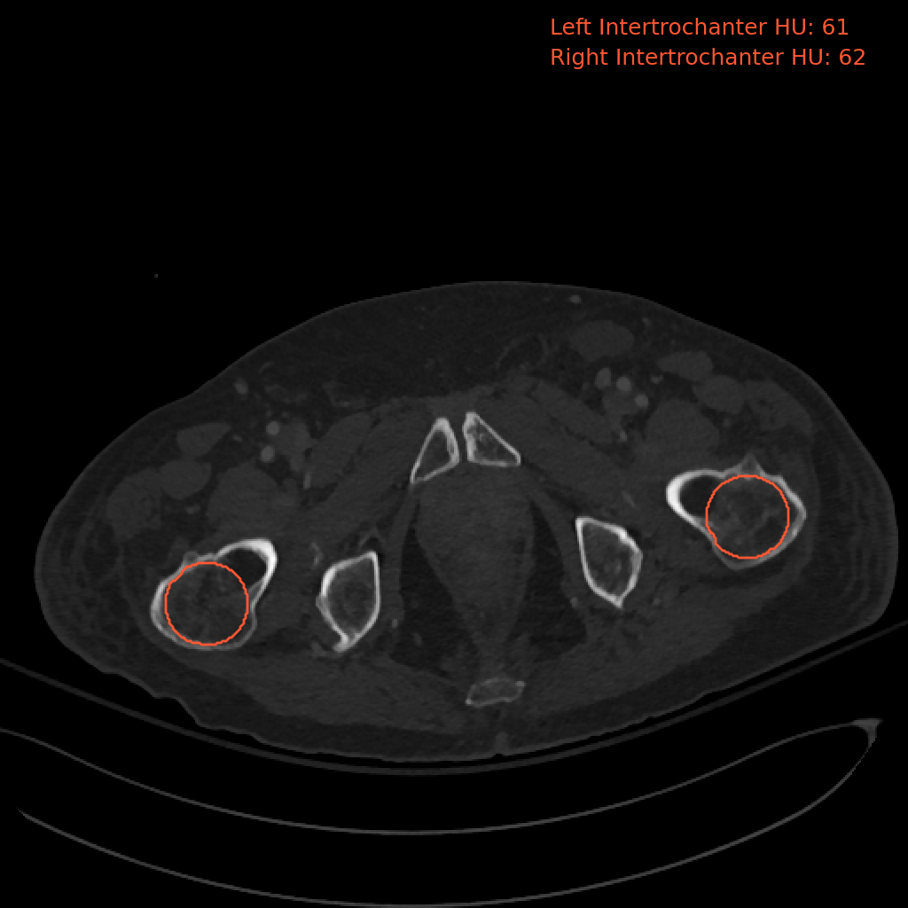

#  Comp2Comp 
[](https://opensource.org/licenses/Apache-2.0)

[](https://comp2comp.readthedocs.io/en/latest/?badge=latest)

[**Paper**](https://arxiv.org/abs/2302.06568)
| [**Installation**](#installation)
| [**Basic Usage**](#basic_usage)
| [**Inference Pipelines**](#basic_usage)
| [**Contribute**](#contribute)
| [**Citation**](#citation)

Comp2Comp is a library for extracting clinical insights from computed tomography scans.

## Installation
<a name="installation"></a>
```bash
git clone https://github.com/StanfordMIMI/Comp2Comp/

# Install script requires Anaconda/Miniconda.
cd Comp2Comp && bin/install.sh
```

Alternatively, Comp2Comp can be installed with `pip`:
```bash
git clone https://github.com/StanfordMIMI/Comp2Comp/
cd Comp2Comp
conda create -n c2c_env python=3.8
conda activate c2c_env
pip install -e .
```

For installing on the Apple M1 chip, see [these instructions](https://github.com/StanfordMIMI/Comp2Comp/blob/master/docs/Local%20Implementation%20%40%20M1%20arm64%20Silicon.md).

## Basic Usage
<a name="basic_usage"></a>
```bash
bin/C2C <pipeline_name> -i <path/to/input/folder>
```

For running on slurm, modify the above commands as follow:
```bash
bin/C2C-slurm <pipeline_name> -i <path/to/input/folder>
```

## Inference Pipelines
<a name="inference_pipeline"></a>
We have designed Comp2Comp to be highly extensible and to enable the development of complex clinically-relevant applications. We observed that many clinical applications require chaining several machine learning or other computational modules together to generate complex insights. The inference pipeline system is designed to make this easy. Furthermore, we seek to make the code readable and modular, so that the community can easily contribute to the project. 

The [`InferencePipeline` class](comp2comp/inference_pipeline.py) is used to create inference pipelines, which are made up of a sequence of [`InferenceClass` objects](comp2comp/inference_class_base.py). When the `InferencePipeline` object is called, it sequentially calls the `InferenceClasses` that were provided to the constructor. 

The first argument of the `__call__` function of `InferenceClass` must be the `InferencePipeline` object. This allows each `InferenceClass` object to access or set attributes of the `InferencePipeline` object that can be accessed by the subsequent `InferenceClass` objects in the pipeline. Each `InferenceClass` object should return a dictionary where the keys of the dictionary should match the keyword arguments of the subsequent `InferenceClass's` `__call__` function. If an `InferenceClass` object only sets attributes of the `InferencePipeline` object but does not return any value, an empty dictionary can be returned. 

Below are the inference pipelines currently supported by Comp2Comp.

## Spine Bone Mineral Density from 3D Trabecular Bone Regions at T12-L5

### Usage
```bash
bin/C2C spine -i <path/to/input/folder>
```
- input_path should contain a DICOM series or subfolders that contain DICOM series.

### Example Output Image
<p align="center">
  
</p>

## End-to-End Spine, Muscle, and Adipose Tissue Analysis at T12-L5

### Usage
```bash
bin/C2C spine_muscle_adipose_tissue -i <path/to/input/folder>
```
- input_path should contain a DICOM series or subfolders that contain DICOM series.

### Example Output Image
<p align="center">
  
</p>

## AAA Segmentation and Maximum Diameter Measurement

### Usage
```bash
bin/C2C aaa -i <path/to/input/folder>
```
- input_path should contain a DICOM series or subfolders that contain DICOM series.

### Example Output Image (slice with largest diameter)
<p align="center">
  
</p>

<div align="center">

| Example Output Video      | Example Output Graph     |
|-----------------------------|----------------------------|
| <p align="center"></p> | <p align="center"></p> |

</div>

## Contrast Phase Detection

### Usage
```bash
bin/C2C contrast_phase -i <path/to/input/folder>
```
- input_path should contain a DICOM series or subfolders that contain DICOM series.
- This package has extra dependencies. To install those, run:
```bash
cd Comp2Comp
pip install -e '.[contrast_phase]'
```

## 3D Analysis of Liver, Spleen, and Pancreas

### Usage
```bash
bin/C2C liver_spleen_pancreas -i <path/to/input/folder>
```
- input_path should contain a DICOM series or subfolders that contain DICOM series.

### Example Output Image
<p align="center">
  
</p>

## 3D Analysis of the Femur

### Usage
```bash
bin/C2C hip -i <path/to/input/folder>
```
- input_path should contain a DICOM series or subfolders that contain DICOM series.

### Example Output Image
<p align="center">
  
</p>

## Abdominal Aortic Calcification Segmentation

### Usage
```bash
bin/C2C aortic_calcium -i <path/to/input/folder>
```
- input_path should contain a DICOM series or subfolders that contain DICOM series.

### Example Output
```
Statistics on aortic calcifications:
Total number:            7
Total volume (cm³):      0.348
Mean HU:                 570.3+/-85.8
Median HU:               544.2+/-85.3
Max HU:                  981.7+/-266.4
Mean volume (cm³):       0.005+/-0.059
Median volume (cm³):     0.022
Max volume (cm³):        0.184
Min volume (cm³):        0.005
```

## Pipeline that runs all currently implemented pipelines

### Usage
```bash
bin/C2C all -i <path/to/input/folder>
```
- input_path should contain a DICOM series or subfolders that contain DICOM series.

## Contribute
<a name="contribute"></a>
If you would like to contribute to Comp2Comp, we recommend you clone the repository and install Comp2Comp with `pip` in editable mode.

```bash
git clone https://github.com/StanfordMIMI/Comp2Comp
cd Comp2Comp
pip install -e '.[dev]'
make dev-lint
```

To run tests, run:
```bash
make autoformat
```

## Citation
<a name="citation"></a>
``` 
@article{blankemeier2023comp2comp,
  title={Comp2Comp: Open-Source Body Composition Assessment on Computed Tomography},
  author={Blankemeier, Louis and Desai, Arjun and Chaves, Juan Manuel Zambrano and Wentland, Andrew and Yao, Sally and Reis, Eduardo and Jensen, Malte and Bahl, Bhanushree and Arora, Khushboo and Patel, Bhavik N and others},
  journal={arXiv preprint arXiv:2302.06568},
  year={2023}
}
```

In addition to Comp2Comp, please consider citing TotalSegmentator:
```
@article{wasserthal2022totalsegmentator,
  title={TotalSegmentator: robust segmentation of 104 anatomical structures in CT images},
  author={Wasserthal, Jakob and Meyer, Manfred and Breit, Hanns-Christian and Cyriac, Joshy and Yang, Shan and Segeroth, Martin},
  journal={arXiv preprint arXiv:2208.05868},
  year={2022}
}
```


